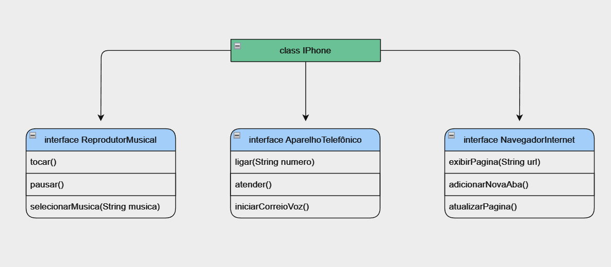

# Desafio POO

O desafio consiste em modelar e diagramar a representação UML do componente iPhone, abrangendo suas funcionalidades como Reprodutor Musical, Aparelho Telefônico e Navegador na Internet. O objetivo é exercitar os conceitos de POO com foco no funcionamento de interfaces em java.

## Diagrama UML

